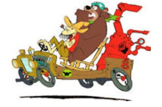

#  El alambique viajero

## Pautas para la resolución del ejercicio
Desarrollar la solución en el archivo:
- alambiqueViajero1.wlk

No realizar cambios en nombre de archivo, ya que las correcciones solo tienen en cuenta los objetos modelados en los mismos. 
Respecto a los nombres de objetos y nombres de mensajes a utilizar en el modelado, remitirse al **glosario** de "nombres obligatorios" que está al pie de este documento (respetar mayúsculas y minúsculas). En caso que utilicen  nombres distintos, los test de las correcciones no funcionarán y restan puntos de la calificación. Tener en cuenta que pueden y algunas veces deben definir métodos y objetos auxiliares, pero los que figuran como obligatorios si o si tienen que existir para que corran los test, y deben cumplir la funcionalidad correcta.

---

## Enunciado

## Los Viajes de Luke

A Luke le gusta viajar por el mundo y traerse recuerdos. 
Suele ir en el "alambique veloz" pero en ocasiones cambia de vehículo.

Averiguar:
1. Cuántos lugares visitó Luke
2. El recuerdo que se trajo del último lugar que visitó

Para ello es necesario tener en cuenta:

Cuando viaja se trae un recuerdo típico del lugar visitado que conserva en un lugar destacado de su casa. El problema es que su casa es pequeña, por lo que tira el recuerdo que haya traído de algún viaje anterior. El vehículo utilizado para viajar sufre las consecuencias. Cuando pretende visitar una ciudad a la que no puede ir, simplemente no va. 

Se conocen los siguientes recuerdos:
- El recuerdo típico de París es un llavero de la torre eiffel.
- Buenos Aires tiene como recuerdo típico un mate, pero dependiendo de quién sea el presidente puede traerse un "mate con yerba" o "mate sin yerba".
- El recuerdo típico de Bagdad puede cambiar, en algún momento pudo haber sido un bidón con petróleo crudo, alguna de las armas de destrucción masiva que nunca se encontraron o una réplica de los míticos jardines colgantes de Babilonia. O tal vez en el momento que viaje Luke sea otro diferente. 
- Las Vegas, mas que tener algo típico propio, hace "homenaje" a otros lugares. Por ejemplo, si es visitada cuando se está conmemorando a París, el recuerdo es también el llavero de la torre eiffel y si se estuviera recordando a Buenos Aires, sería el mate. 
- Cada viaje que hace el alambique veloz consume 10 unidades de combustible (arranca con el tanque lleno en 50 unidades). Puede recargar el tanque en cualquier momento. El alambique es un veículo rápido. 

Para poder ir a las ciudades, hay diferentes restricciones en las que interviene el vehículo que maneja Luke, que en principio es el Alambique veloz:
- París, tiene que tener suficiente combustible (para viajar se necesita al menos 10 unidades)
- Buenos Aires, tiene que ser rápido
- Bagdad no hay restricciones
- Las Vegas: la misma restricción del lugar que se esté homenajeando 

Nuevos requerimientos:

Se agregan otros vehículos que puede usar Luke para viajar, en vez del Alambique Veloz: 
- El súper chatarra especial puede tener caniones puestos o no. Al inicio está sin los caniones, pero cada vez que visita una ciudad, pone los caniones si no los tenía puestos, o los quita si ya los tenía puestos.
Su combustible es 50 si tiene los caniones puestos, si no 80 y no requiere recargar, siempre tiene la cantidad según la condición ya descripta. Nunca es rápido. 
- La Antigualla Blindada tiene una cantidad de gangster variable, arranca en 5 pero se puede cambiar por cualquier valor mayor  igual que 1. Es rádida si tiene menos de 7 gangsters.  Siempre tiene 50 unidades de combustible y no se consume. Cuando visita una ciudad no le pasa nada, no sufre ninguna consecuencia.

Definir 2 vehículos más, su estado interno y su comportamiento con creatividad, de manera que a pesar de ser diferentes, puedan también ser usados por Luke para viajar de acuerdo a lo planteado anteriormente. 

Crear también una ciudad más, respetando lo indicado anteriormente.

Estos agregados nuevos no deben cambiar la definición de los objetos anteriores. 

### Glosario de nombres de objeto y mensajes obligatorios

#### **Objetos**
- alambiqueVeloz
- antiguallaBlindada
- bagdad
- buenosAires
- lasVegas
- luke
- paris
- superChatarraEspecial

#### **Métodos**
- cambiarCantidadDeGangsters
- cambiarCiudadHomenajeada
- cambiarDeVehiculo
- cambiarRecuerdo
- cantidadDeLugaresVisitados
- puebloEligePresidenteBueno
- puebloEligePresidenteMalo
- recuerdo
- viajar

#### Algunos de los recuerdos obligatorios
- "mate con yerba"
- "mate sin yerba"
- "llavero torre eiffel"
- "jardines colgantes"
- "bidon de crudo"
- "bomba atomica"
